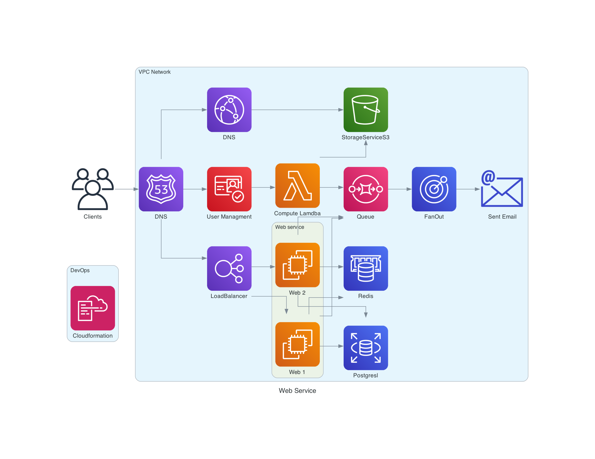

# Project Structure

The following is the structure of the project:
.github/ - Contains the GitHub Actions workflow file
backend/ - Contains the backend code
config/ - Contains the configuration files
docs/ - Contains the documentation
iac/ - Contains the Infrastructure as Code (IaC) code

# Prerequisites
- Java 17
- Gradle 7.3.3
- Docker
- Docker Compose
- AWS CLI
- AWS CDK
- AWS Account

# Architecture
The following is the architecture of the project:


# Setup
1. Clone the repository
2. Change the directory to the project root
3. Run the following command to build the project:
```shell
gradle clean build
```

